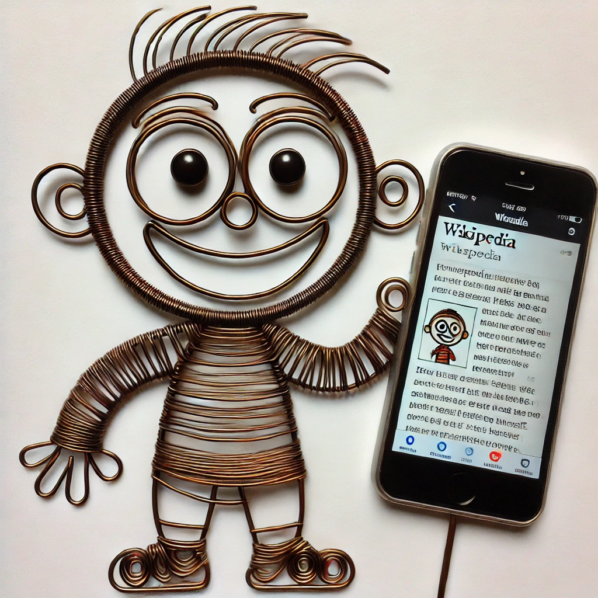

<html>
<meta charset="UTF-8">
<title>ME</title>
<meta name="viewport" content="width=device-width,initial-scale=1">
<link rel="stylesheet" href="https://www.w3schools.com/w3css/4/w3.css">
<link href="https://cdnjs.cloudflare.com/ajax/libs/font-awesome/6.0.0-beta3/css/all.min.css" rel="stylesheet">

<body>

<!-- Navigation (Sits on top) -->

<a href="#home" class="w3-bar-item w3-button" style="font-size: 39px; color: #8E403A; font-family: 'Brush Script MT', cursive;">Coming Soon</a>

<!-- Right-sided navbar links. Hide them on small screens -->

<!-- Start Content -->

<!-- Image in Display Container -->

 

<h2>---</h2>

<h5 style="font-size: 28px;" class="w3-center">Innovating since Nov 2024</h5>
<!-- About -->

<h1 class="w3-center">Profile</h1>

Our platform is a social media website where individuals can create personalized profiles. Connect, discover, and explore others’ profiles in a community built for self-expression and meaningful interactions.

<h1 class="w3-center">Messaging</h1>

Our social media platform enables individuals to connect instantly through seamless text messaging. Stay in touch with friends, family, and new connections with real-time chats, private conversations, and group messaging. Share thoughts, updates, and moments effortlessly in a secure and user-friendly environment.

    <i class="fas fa-eye"></i> Loading...
  

  

